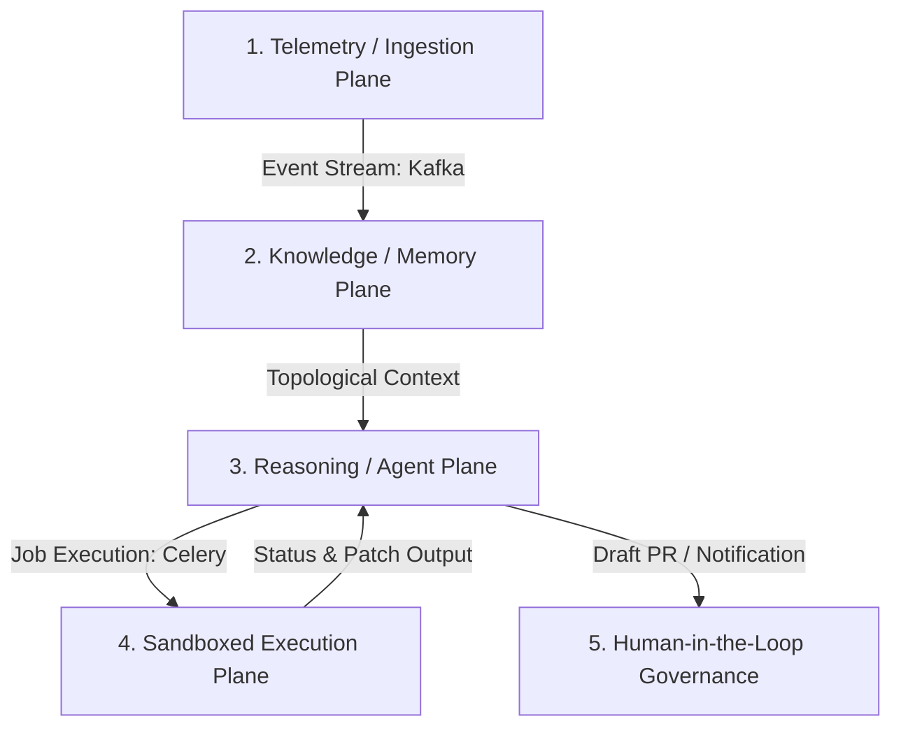

# Architecture Specification
## Kautilya AI (Omni Graph AI)

### 1. Overview & The 5-Plane Flow
Kautilya AI uses a decoupled, event-driven design to avoid synchronous blocking calls. When a high-priority telemetry event is received, it propagates asynchronously across five logical planes:



1. **Telemetry/Ingestion Plane:** Receives, validates, dedupes, and normalizes alerts from monitoring systems (Datadog, Prometheus, Alertmanager, PagerDuty). Normalized events are immediately pushed to Kafka/RabbitMQ.
2. **Knowledge/Memory Plane:** Subscribes to the Kafka stream. Alerts are ingested into Neo4j, updating the topology and health status of nodes. Simultaneously, PostgreSQL + pgvector indexes incoming logs/traces for semantic search, and Redis caches transient incident states.
3. **Reasoning/Agent Plane:** Triggered by updates to the Knowledge Plane. A LangGraph state machine orchestrates the diagnostic runbook. LLM planners (Claude 3.5 Sonnet / GPT-4o) generate step-by-step reasoning plans and call tools exposed via Model Context Protocol (MCP) to retrieve additional logs, code snippets, or metrics.
4. **Sandboxed Execution Plane:** The agent delegates remediation actions to Celery workers. The worker spins up an ephemeral, hardened Docker-in-Docker (DinD) sandbox within the customer environment, clones the code, applies the candidate patch, and runs tests to verify the fix.
5. **Human-in-the-Loop (HITL) Governance:** A secure API Gateway collects sandbox logs, confidence scores, and git diffs, exposing them via the Next.js UI dashboard and a Slack app. The system blocks deployment until a human issues a cryptographic approval.

---

### 2. Boundary Model: Vendor Cloud vs. Customer VPC
To meet enterprise security standards, Kautilya AI splits components between the **Vendor Cloud** (orchestration, UI, LLM coordination) and the **Customer VPC** (source code access, data storage, sandbox execution).

```
+---------------------------------------------------------------------------------------------------+
|                                        VENDOR CLOUD                                               |
|                                                                                                   |
|  +--------------------+      +--------------------+      +--------------------+                   |
|  |    Next.js UI      |      |   API Gateway      |      |   LangGraph Agent  |                   |
|  |    (Dashboard)     |      |   (Fail-Closed)    |      |     (Orchestrator) |                   |
|  +---------^----------+      +---------^----------+      +---------^----------+                   |
+------------|---------------------------|---------------------------|------------------------------+
             |                           |                           | (Egress-only Polling/gRPC)
             +---------------------------+---------------------------+
                                         |
                                         v
+---------------------------------------------------------------------------------------------------+
|                                       CUSTOMER VPC                                                |
|                                                                                                   |
|  +---------------------------------------------------------------------------------------------+  |
|  |                                  Customer Relay Proxy                                       |  |
|  +---------------------------------------------+-----------------------------------------------+  |
|                                                |                                                  |
|       +----------------------------------------+----------------------------------------+         |
|       |                                        |                                        |         |
|       v                                        v                                        v         |
|  +------------+                           +------------+                           +------------+ |
|  | Neo4j & DB |                           | DinD Runner|                           | WORM Logs  | |
|  | (Local Rep)|                           | (Sandbox)  |                           | (S3 Lock)  | |
|  +------------+                           +------------+                           +------------+ |
|                                                                                                   |
+---------------------------------------------------------------------------------------------------+
```

#### 2.1. Vendor Cloud (Control Plane)
* **Next.js Web Application:** Displays incident status, dynamic graphs, agent logs, and approval prompts.
* **API Gateway:** Manages system authentication, billing, webhook delivery interfaces, and routes approval requests.
* **Agent Orchestrator:** Hosts the LangGraph state machine. It contains no customer source code and processes only metadata, structural topologies, and localized system logs.

#### 2.2. Customer VPC (Data & Execution Plane)
* **Customer Relay Proxy:** An egress-only, stateless agent that polls the Vendor Cloud control plane using long-polling HTTPS or persistent gRPC tunnels (mTLS). **No inbound ports are opened on the customer firewall.**
* **Local Data Layer:** Contains customer databases (Neo4j topology cache, PostgreSQL with local code embeddings, and Redis). This data never leaves the Customer VPC.
* **Docker-in-Docker (DinD) Sandbox:** Ephemeral compute resources that spin up on demand to download source code, run builds, execute tests, and run patches.
* **WORM Log Bucket (S3 Object Lock):** Stores immutable execution logs, LLM traces, and command history for strict audit compliance.

---

### 3. Tech Stack Matrix

| Layer | Technology | Rationale |
|---|---|---|
| **Frontend** | Next.js 14 (App Router), Tailwind CSS, Lucide React, WebSockets | Unified server-side rendering, fast real-time updates via WebSockets, and standard component-based dashboarding. |
| **Backend** | Python 3.11+, FastAPI, Celery, Redis | Fast, async-first framework for API endpoints; Celery handles distributed background execution of resource-heavy sandbox runs. |
| **Data Layer** | Neo4j (v5+ Enterprise), PostgreSQL (v16) + pgvector, Redis (HA Cluster) | Neo4j maps topological graph relationships; pgvector provides fast semantic search over logs and traces; Redis handles state caches and task queues. |
| **AI / Agentic** | LangGraph, Model Context Protocol (MCP), Anthropic / OpenAI APIs | LangGraph defines non-linear, cyclic state-machine flows; MCP standardizes agent interactions with local files, logs, and environments. |
| **Sandbox** | Docker-in-Docker (DinD), sysbox | Provides isolation for running test suites and compilation steps in a clean, reproducible environment. |
| **Infrastructure** | AWS EKS, Terraform, AWS KMS, S3 Object Lock | Scalable Kubernetes clustering, reproducible infrastructure-as-code, hardware-backed secrets encryption, and immutable audit logs. |

---

### 4. Monorepo Directory Structure

```
/kautilya-ai-monorepo
├── apps/
│   ├── web/                    # Next.js 14 Frontend Application
│   ├── api/                    # FastAPI Backend Service (Ingestion & API Gateway)
│   ├── relay/                  # Customer VPC Egress-Only Relay Agent
│   └── worker/                 # Celery Worker for Sandboxed Executions
├── packages/
│   ├── agent-core/             # LangGraph State-Machine Definitions & Planners
│   ├── db-schema/              # Neo4j Cypher and Postgres SQL Schemas (Prisma/SQLAlchemy)
│   ├── mcp-servers/            # Custom Model Context Protocol servers (Git, Logs, K8s)
│   └── sandbox-executor/       # Hardened Docker-in-Docker automation libraries
├── infra/
│   ├── terraform/              # AWS EKS, KMS, RDS, S3 Object Lock IaC
│   ├── docker/                 # Dev & Prod Dockerfiles (Local Compose & Kubernetes)
│   └── helm/                   # Kubernetes Deployment Charts
├── docs/                       # Monorepo Documentation (PRD, Architecture, Rules, etc.)
└── package.json                # Turborepo Monorepo Root Config
```
